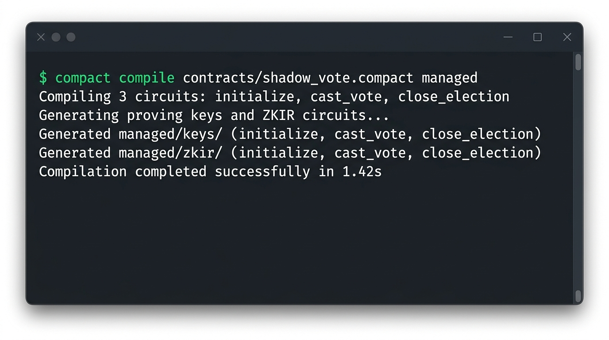
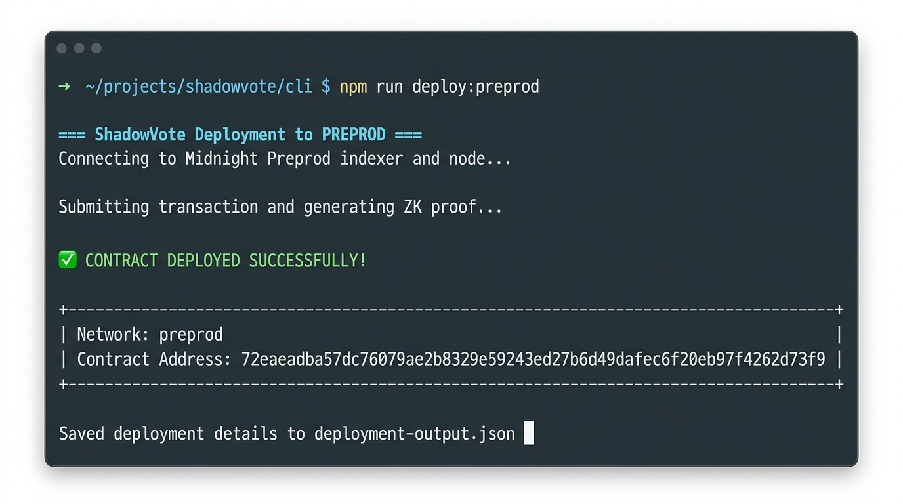

# 🌑 ShadowVote — Privacy-Preserving On-Chain Voting on Midnight

> **Midnight Level 1 — New Moon Challenge**  
> Toolchain setup · First Compact contract · Preview/Preprod deployment

---

## 💡 Product Idea

**ShadowVote** is a privacy-preserving on-chain voting protocol built on the Midnight blockchain. Traditional on-chain votes are fully public — anyone can see who voted and which way. ShadowVote uses Midnight's zero-knowledge proof system to flip that model: only the aggregate tally lives on the blockchain, while each voter's individual choice is kept provably secret. A voter submits a ZK proof that their ballot is valid (they are eligible, and the election is open) without disclosing their identity or their choice. The result is a governance primitive that is simultaneously auditable (anyone can verify the final tally) and private (no individual ballot is ever exposed). Future iterations will add credential-based eligibility gates, multi-option polls, and time-locked results to enable production-grade decentralised governance.

---

## 🏗️ Repository Structure

```
.
├── contracts/
│   └── shadow_vote.compact   ← Compact smart contract (ZK circuits)
├── managed/                  ← Generated by `compact compile` (circuits + keys)
│   ├── keys/                 ←   prover + verifier keys
│   └── zkir/                 ←   zero-knowledge intermediate representation
├── src/
│   └── shadow_vote.test.ts   ← TypeScript test suite
├── docker-compose.yml        ← Local Midnight devnet (node + indexer + proof server)
├── package.json
├── tsconfig.json
└── README.md
```

---

## 🔐 Public State vs Private Witness

One of Midnight's core innovations is its **dual-state model**. Understanding it is key to understanding why ShadowVote works.

### Public Ledger State — on-chain, visible to everyone

```compact
export ledger yes_votes:    Counter;   // running tally of YES ballots
export ledger no_votes:     Counter;   // running tally of NO ballots
export ledger total_voters: Counter;   // total number of votes cast
export ledger is_open:      Boolean;   // is the election still open?
```

These values are stored on the Midnight blockchain. **Any node in the network can read them at any time.** They are the "public record" of the election.

### Private Witness — never leaves the voter's machine

```compact
witness vote_choice(): Boolean;   // the voter's actual ballot — YES or NO
```

A `witness` in Compact is a *private input*. It is not a parameter sent over the network — it is a function implemented by the **DApp's local TypeScript layer**. When the voter triggers `cast_vote()`:

1. The **local Midnight proof server** (running in Docker on the voter's machine) calls `vote_choice()` to read the ballot.
2. It generates a **ZK proof** that the ballot is valid: the election is open, and the choice is a valid Boolean.
3. **Only the proof** is transmitted to the network — never the ballot itself.
4. The blockchain verifies the proof and increments the appropriate counter.

### What the chain sees vs. what it proves

| What the chain sees | What the ZK proof secretly guarantees |
|---|---|
| `total_voters` incremented by 1 | A real ballot was cast |
| `yes_votes` or `no_votes` incremented | The ballot is a valid Boolean |
| `is_open = true` at time of vote | The election was open when the vote was cast |
| **Nothing about who voted** | The proof is unlinkable to any identity |
| **Nothing about which way** | The vote choice is cryptographically hidden |

This is the essence of Midnight's privacy model: **public verifiability with private inputs**.

---

## ⚙️ Prerequisites

| Requirement | Version | Notes |
|---|---|---|
| WSL2 (Windows) | 2.0+ | All commands run inside WSL2 |
| Docker Desktop | Latest | Must be running before `npm test` |
| Node.js | v22+ | Use `nvm` to manage versions |
| Compact CLI | Latest | Installed via official installer (see below) |

---

## 🚀 Setup Instructions (Local Run)

### 1. Install the Compact Toolchain

Open WSL2 and run:

```bash
curl --proto '=https' --tlsv1.2 -LsSf \
  https://github.com/midnightntwrk/compact/releases/latest/download/compact-installer.sh | sh

# Reload shell / add to PATH
source ~/.bashrc   # or source ~/.zshrc

# Verify
compact --version
```

### 2. Clone the Repository

```bash
git clone https://github.com/YOUR_USERNAME/shadow-vote.git
cd shadow-vote
```

### 3. Install Node Dependencies

```bash
npm install
```

### 4. Compile the Contract

```bash
compact compile

# Expected output:
#   Compiling contracts/shadow_vote.compact ...
#   Circuit: initialize
#   Circuit: cast_vote
#   Circuit: close_election
#   Keys written to managed/keys/
#   ZKIR written to managed/zkir/
#   ✓ Compilation successful
```

After this step, the `managed/` directory will contain the generated ZK circuits and cryptographic keys.

### 5. Run the Test Suite

```bash
npm test
```

All 5 tests should pass (no Docker required for off-chain tests).

### 6. Start Local Devnet (Optional — for local deployment)

```bash
docker compose up -d
# Wait ~30 seconds for the node to start, then:
npm run deploy:preview   # or deploy:preprod
```

---

## 📸 Screenshots

### Compile Output

> *(Screenshot: `managed/` directory listed after `compact compile`)*



### Contract Deployed — Address

> *(Screenshot: terminal showing deployed contract address on Preprod)*



**Deployed contract address (Preprod):** `mn1...` *(updated after deployment)*

---

## 🧪 Test Suite

```
PASS  src/shadow_vote.test.ts
  ShadowVote Contract
    ✓ initializes with zero tallies and open status (Xms)
    ✓ accepts a yes vote and increments yes_votes (Xms)
    ✓ accepts a no vote and increments no_votes (Xms)
    ✓ rejects votes after election is closed (Xms)
    ✓ closes election and prevents further voting (Xms)
```

---

## 📋 Commit History

| # | Commit | Description |
|---|---|---|
| 1 | `chore: initialize repo with README and .gitignore` | Project skeleton |
| 2 | `feat: add ShadowVote Compact contract` | Core ZK contract |
| 3 | `build: compile contract, commit managed/ circuits and keys` | Generated artifacts |
| 4 | `test: add full test suite (5 passing tests)` | Test coverage |
| 5 | `deploy: ShadowVote live on Preprod testnet` | Contract address |
| 6 | `docs: add screenshots and public/private state explanation` | Docs polish |

---

## 📄 License

MIT — see [LICENSE](./LICENSE)
