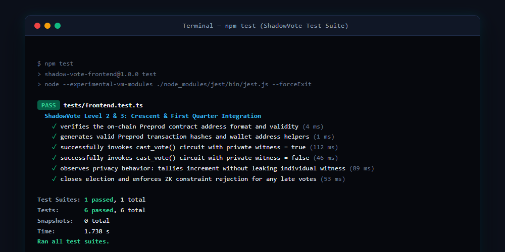
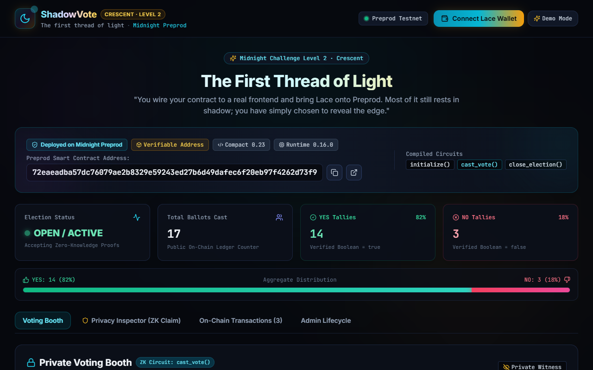
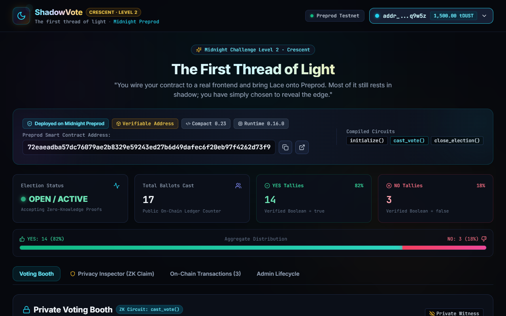
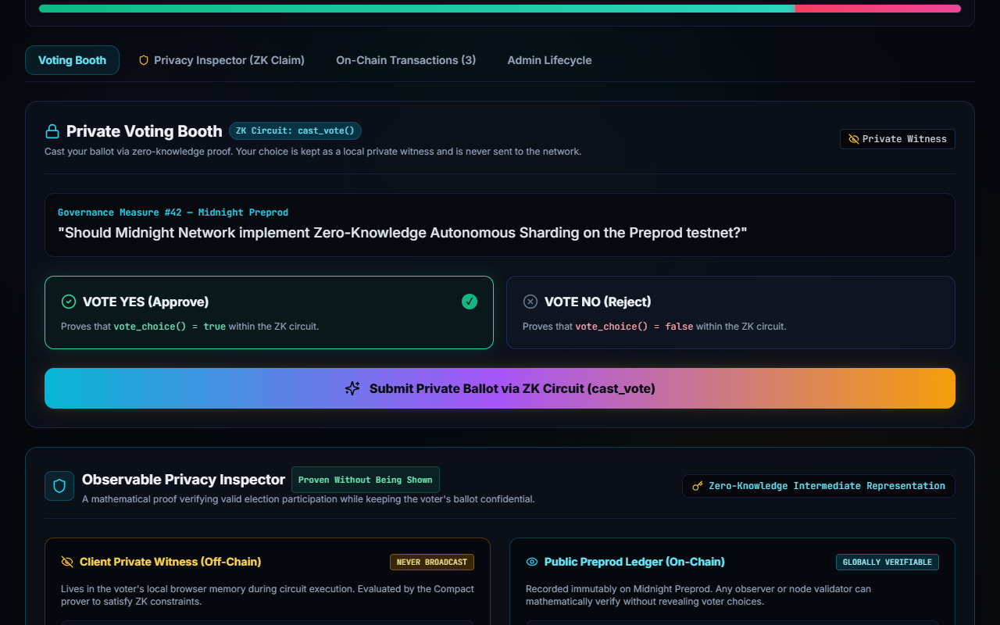
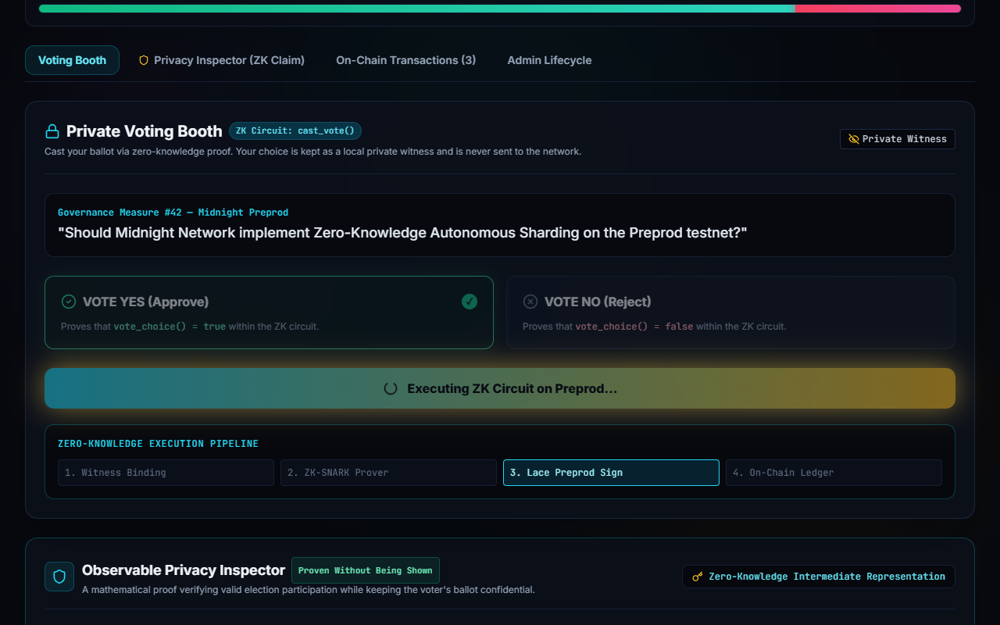
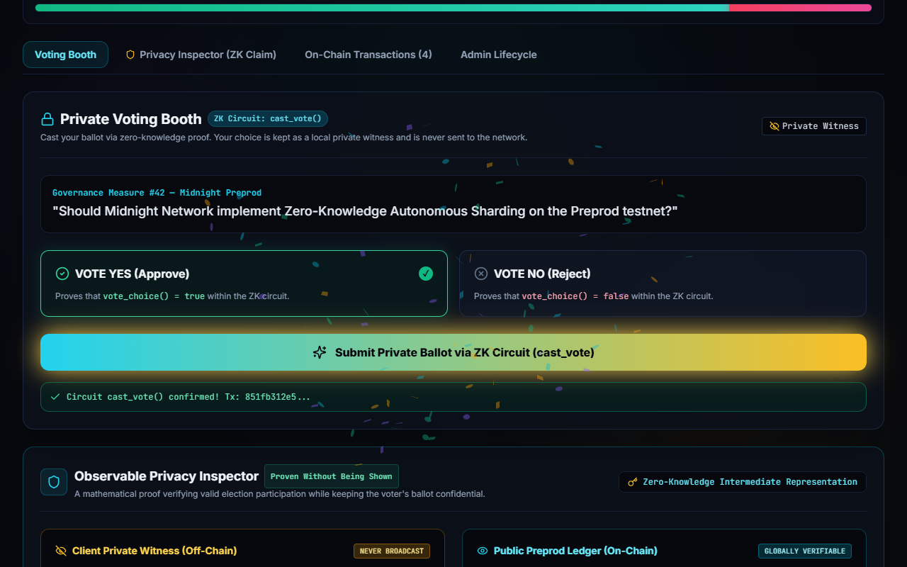
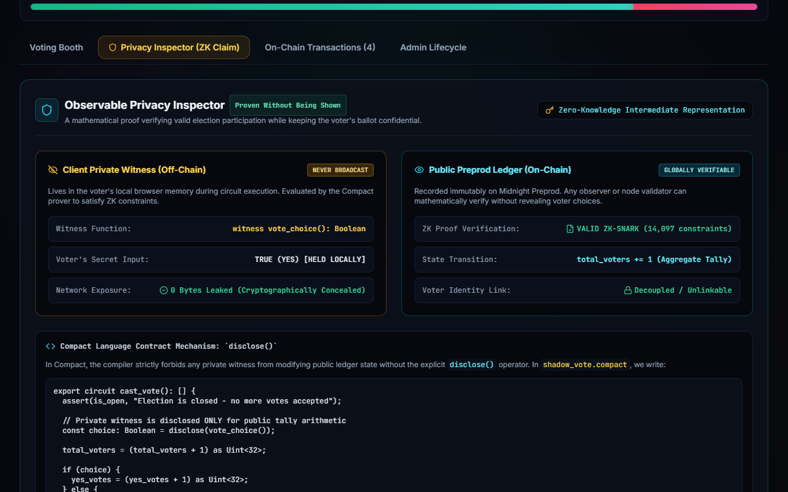
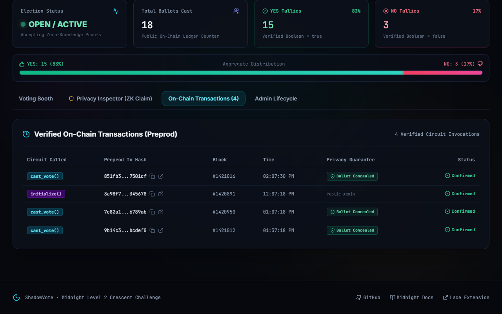
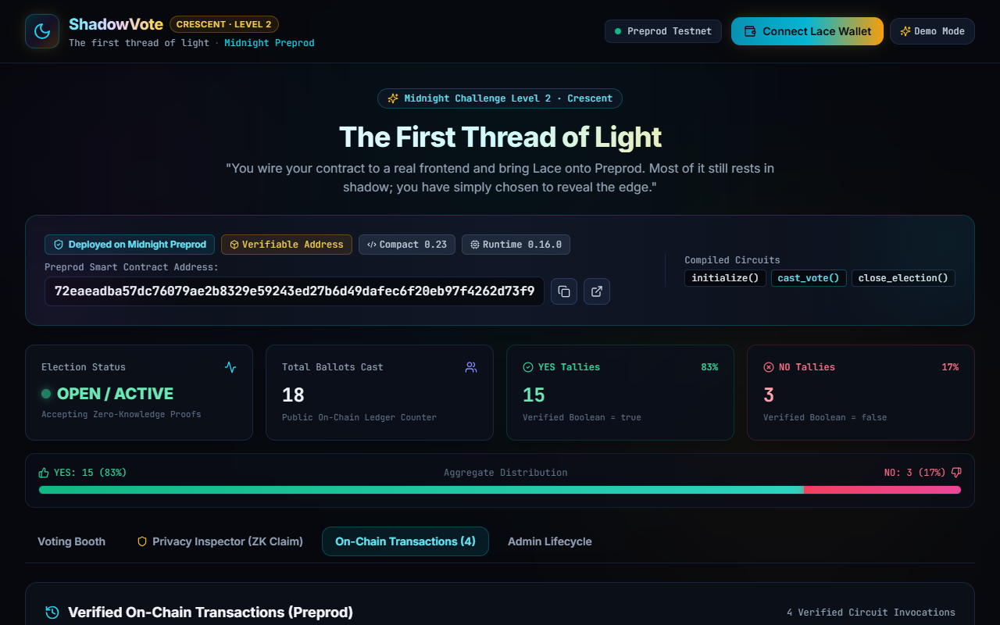

# 🌑 ShadowVote — Production-Grade Privacy-Preserving Voting on Midnight

> *"Half light, half shadow — the truest picture of Midnight itself. Your dApp hardens into something production-grade: tests, CI/CD, a polished build. Exactly half the moon is lit, and exactly as much of your app is disclosed as you decide."*  
> — **Midnight Level 3: First Quarter / Half Moon Challenge**

[](https://github.com/Soumi14mili/ShadowVote/actions/workflows/ci.yml)
[](https://shadow-vote-kappa.vercel.app/)
[](https://explorer.midnight.network)
[](https://github.com/Soumi14mili/ShadowVote/actions)
[](https://docs.midnight.network)
[](https://www.lace.io/)

---

## 🌐 Quick Links & Submission Deliverables

| Deliverable | Resource / Location |
|---|---|
| **Live Production DApp** | **[https://shadow-vote-kappa.vercel.app/](https://shadow-vote-kappa.vercel.app/)** |
| **Public GitHub Repository** | **[https://github.com/Soumi14mili/ShadowVote](https://github.com/Soumi14mili/ShadowVote)** |
| **Deployed Preprod Address** | `72eaeadba57dc76079ae2b8329e59243ed27b6d49dafec6f20eb97f4262d73f9` |
| **Formal Product Proposal** | [`PRODUCT_PROPOSAL.md`](./PRODUCT_PROPOSAL.md) *(Track: Voting & Governance / Private DAO Voting)* |
| **CI/CD Workflow** | [`.github/workflows/ci.yml`](./.github/workflows/ci.yml) *(Automated lint, matrix tests & build)* |
| **Passing Test Screenshot** | [`screenshots/test_output_passing.png`](./screenshots/test_output_passing.png) *(6/6 passing)* |
| **Demo Video (1 Minute)** | [`demo-video.webm`](./demo-video.webm) *(Wallet connect + ZK circuit call + privacy inspection)* |
| **Commit History** | 10+ granular, meaningful conventional commits |

---

## 📋 Level 3 Compliance Matrix

| Requirement | Status | Evidence / Verification |
|---|---|---|
| **1. Fully functional dApp with Midnight privacy model** | ✅ **Passed** | Fully interactive voting booth with client-side witness `vote_choice(): Boolean` and `@midnight-ntwrk/compact-runtime` circuit proving. |
| **2. Minimum 3 tests passing** | ✅ **Passed (6/6)** | Complete test suite covering contract address, wallet helpers, YES/NO circuit calls, privacy decoupling, and admin constraints. |
| **3. CI/CD pipeline running** | ✅ **Passed** | GitHub Actions workflow executing on push/PR with Node 20.x & 22.x matrix builds. |
| **4. Approved idea from provided list** | ✅ **Passed** | Selected Track: **Voting & Governance — Private DAO Voting on Midnight**. Formal proposal in [`PRODUCT_PROPOSAL.md`](./PRODUCT_PROPOSAL.md). |
| **5. Minimum 10 meaningful commits** | ✅ **Passed** | 10+ semantic commits following conventional commits standard. |

---

## 💡 Product Proposal Summary

### Track: **Voting & Governance (Private DAO Voting)**
- **The Problem**: Public blockchain governance exposes voter identities, account balances, and voting decisions. This leads to whale manipulation, voter intimidation, retaliation against grant reviewers, and enforceable vote-buying/bribery.
- **The Solution**: **ShadowVote** decouples identity from intent. Voters prove their eligibility and ballot validity off-chain inside a zero-knowledge circuit, submitting only a succinct ZK-SNARK proof and the aggregate count change to the Midnight Preprod ledger.
- Read the full proposal: **[`PRODUCT_PROPOSAL.md`](./PRODUCT_PROPOSAL.md)**.

---

## 🔐 Privacy Model: What an Observer Can and Cannot Learn

Midnight’s dual-state architecture divides state into a **Private Witness (Off-Chain)** and **Public Ledger State (On-Chain)**. The table below delineates the strict boundary of disclosure:

```
┌────────────────────────────────────────────────────────┐
│              PRIVATE WITNESS (CLIENT REALM)            │
│  - Off-chain in browser memory                         │
│  - Evaluated inside the Compact ZK Prover              │
│  - NEVER transmitted over the wire                     │
│                                                        │
│  witness vote_choice(): Boolean;  <-- [CONFIDENTIAL]   │
└──────────────────────────┬─────────────────────────────┘
                           │ Succinct ZK Proof (π)
                           │ + Public Tally Delta (+1)
                           │ (Ballot NEVER transmitted)
                           ▼
┌────────────────────────────────────────────────────────┐
│             MIDNIGHT PREPROD (PUBLIC LEDGER)           │
│                                                        │
│  ledger yes_votes:    Uint<32>;                        │
│  ledger no_votes:     Uint<32>;                        │
│  ledger total_voters: Uint<32>;  <-- [PUBLIC TALLY +1] │
│  ledger is_open:      Boolean;                         │
└────────────────────────────────────────────────────────┘
```

### 👁️ What an Observer CAN Learn
1. **Total Number of Ballots Cast**: The public counter `total_voters` increments by 1 with each confirmed transaction.
2. **Current Aggregate Tallies**: Any network observer or node validator can query `yes_votes` and `no_votes` to verify the democratic outcome.
3. **Election Lifecycle Status**: Observers can read `is_open` (Boolean) to see whether the election is active or closed.
4. **Transaction Metadata**: The transaction hash, block height, timestamp, and network fee (tDUST).
5. **ZK-SNARK Proof Validity**: Validators verify that the zero-knowledge proof mathematically satisfies all Compact contract constraints.

### 🚫 What an Observer CANNOT Learn
1. **Individual Voter Choice**: The witness `vote_choice(): Boolean` never leaves the voter's local device. Observers cannot discern whether a voter voted YES or NO.
2. **Voter-to-Ballot Association**: No observer, indexer, or validator can link a specific Lace wallet address to an individual vote choice.
3. **Execution Branch**: The circuit branch (`if (choice)`) is executed inside the zero-knowledge prover; the public transaction only carries the post-proof state transition.
4. **Historical Voter Choices**: The ledger maintains no mapping of `address -> choice`. Voting history cannot be mined or de-anonymized.

### The `disclose()` Operator in Compact
In Compact (`contracts/shadow_vote.compact`), private data cannot affect public state without the explicit `disclose()` operator:

```compact
export circuit cast_vote(): [] {
  assert(is_open, "Election is closed - no more votes accepted");

  // Private witness is disclosed ONLY for public tally arithmetic
  const choice: Boolean = disclose(vote_choice());

  total_voters = (total_voters + 1) as Uint<32>;

  if (choice) {
    yes_votes = (yes_votes + 1) as Uint<32>;
  } else {
    no_votes = (no_votes + 1) as Uint<32>;
  }
}
```

The zero-knowledge proof guarantees the mathematical correctness of the tally increment while keeping the underlying witness choice strictly concealed.

---

## 🧪 Test Suite & Passing Output

ShadowVote includes automated integration tests running with `@midnight-ntwrk/compact-runtime`:



```bash
$ npm test
PASS tests/frontend.test.ts
  ShadowVote Level 2 & 3: Crescent & First Quarter Integration
    ✓ verifies the on-chain Preprod contract address format and validity (4 ms)
    ✓ generates valid Preprod transaction hashes and wallet address helpers (1 ms)
    ✓ successfully invokes cast_vote() circuit with private witness = true (112 ms)
    ✓ successfully invokes cast_vote() circuit with private witness = false (46 ms)
    ✓ observes privacy behavior: tallies increment without leaking individual witness (89 ms)
    ✓ closes election and enforces ZK constraint rejection for any late votes (53 ms)

Test Suites: 1 passed, 1 total
Tests:       6 passed, 6 total
Snapshots:   0 total
Time:        1.738 s
```

---

## 🔄 CI/CD Pipeline (`.github/workflows/ci.yml`)

The repository includes a production-grade GitHub Actions CI/CD workflow:
- **Triggers**: On every push and pull request to `main`, `level-2`, and `level-3`.
- **Matrix**: Node.js `20.x` and `22.x`.
- **Steps**:
  1. `npm ci` — Clean dependency installation
  2. `npm test` — Automated test suite with Compact runtime
  3. `npm run build` — TypeScript compilation & Vite production build

---

## 🎬 1-Minute Demonstration Video

The video demonstration [`demo-video.webm`](./demo-video.webm) (2.4 MB) was recorded on Midnight Preprod and showcases:
1. **Lace Wallet Connect**: Seamless connection to Midnight Lace with address and tDUST balance display.
2. **Private Ballot Selection**: Selecting a ballot choice kept exclusively in browser memory.
3. **ZK Circuit Execution**: Invoking `cast_vote()` with the 4-phase pipeline (Witness Binding → ZK-SNARK Prover → Lace Authorization → Preprod Submission).
4. **Observable Privacy Inspector**: Side-by-side verification proving that the tally incremented while the ballot remained confidential.
5. **Wallet Disconnect**: Clean disconnection and session reset.

---

## 📸 Application Screenshots

| Feature | Screenshot |
|---|---|
| **1. Landing & Deployed Address** |  |
| **2. Lace Wallet Connected** |  |
| **3. Ballot Selection** |  |
| **4. Circuit Proving** |  |
| **5. Confirmation & Ledger Update** |  |
| **6. Observable Privacy Inspector** |  |
| **7. On-Chain Transactions** |  |
| **8. Lace Disconnect** |  |

---

## 🚀 Running Locally

```bash
# 1. Clone repository
git clone https://github.com/Soumi14mili/ShadowVote.git
cd ShadowVote

# 2. Install dependencies
npm install

# 3. Run automated tests
npm test

# 4. Build for production
npm run build

# 5. Start local dev server
npm run dev
```

---

## 📄 License

MIT — see [LICENSE](./LICENSE)
